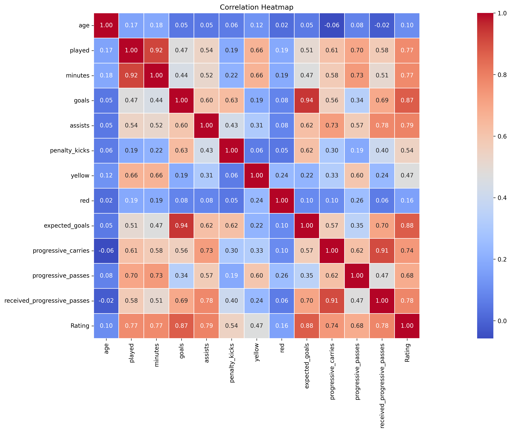

# ⚽ Premier League 2025 - Data Analysis

This project explores and analyzes the Premier League 2025 season using a dataset containing match results, team statistics, player salaries, and performance indicators. The goal is to extract meaningful insights from the data and understand patterns in team and player performance.

## 📂 Dataset

- Source: [Kaggle Dataset - Premier League 2025 Stats](https://www.kaggle.com/datasets/flynn28/2025-premier-league-stats-matches-salaries)
- Contents:
  - Match results
  - Team statistics (wins, goals, goals conceded, points)
  - Player statistics and salaries
  - Award nominees (e.g. Young Player of the Season)

## ⚙️ Technologies Used

- Python 3.x
- Pandas
- NumPy
- Seaborn
- Matplotlib
- Jupyter Notebook

## 🔍 What the analysis includes

- Exploratory Data Analysis (EDA) on team and player stats
- Visualizations of team performance and comparisons
- Identification of top players and salary patterns
- Correlation analysis between features
- Highlighting standout teams and young players

## 📊 Key Visualizations 

- Heatmaps of statistical correlations
- Barplots of wins, points, and goals per team
- Salary comparisons among top players
- Custom rankings (e.g. Young Player of the Season nominees)

## 🖼️ Sample Visualization

## 🧠 Insights

See the summary of insights at the end of the notebook for conclusions about team performance, standout players, and statistical trends.

## ▶️ How to Run

1. Clone the repository
2. Make sure you have Python 3 installed
3. Install dependencies:
